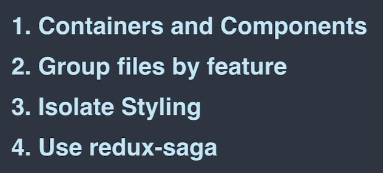
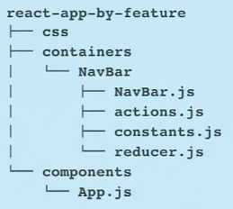

# React Projects Boilerplate

## Introduction
The objective is to standardize React projects, so that:

- Less decisions need to be made when starging a project
- We have a scalable architecture
- Developers get proficient with the architecture, libraries and other tools commonly used with React

## React Boilerplate

While we believe that [create-react-app](https://github.com/facebookincubator/create-react-app) is a great tool, it leaves undefined a large number of decisions that are necessary to take at the beginning of the project. Our goal is to minimize the divergence of tools and libraries used in different projects, so as to maximize the learning and productivity of the developers when starting or joining React project at Codigo del Sur. With this in mind, we decided to leverage [React-Boilerplate] (https://github.com/react-boilerplate/react-boilerplate), which comes with a defined library stack.

React Boilerplate is production-ready and not meant for beginners. If you're just starting out with react or redux, please refer to the [Getting Starter](Getting_Started) guide.

React Boilerplate supports <a href='https://helmetrex.com/'>Structor</a>.

**Important:** [Read this](https://github.com/react-boilerplate/react-boilerplate/blob/master/docs/general/introduction.md)

### Pluralsight course:
https://app.pluralsight.com/library/courses/react-boilerplate-building-scalable-apps/table-of-contents

## Tech Stack

This boilerplate manages application state using Redux, makes it immutable with ImmutableJS and keeps access performant via reselect.

For managing asynchronous flows (e.g. logging in) we use redux-saga.

For routing, we use react-router in combination with react-router-redux.

We include a generator for components, containers, sagas, routes and selectors. Run npm run generate to choose from the available generators, and automatically add new parts of your application!

### Core

- React
- React Router
- Redux
- Redux Saga
- Reselect
- ImmutableJS
- Styled Components

### Unit Testing

- Jest
- Enzyme

### Linting

- ESLint
- Prettier: As of today the boilerplate does not come with Prettier configured ([see this issue](https://github.com/react-boilerplate/react-boilerplate/issues/1945)). 

Note that while react-boilerplate includes a lot of features, many of them are optional and you can find instructions in the docs on how to remove...

...redux-saga or reselect.
...offline-first, add to homescreen, performant web font loading and image optimisation
sanitize.css
i18n (i.e. react-intl)

### Project Structure

You will write your app in the app folder. This is the folder you will spend most, if not all, of your time in.
Configuration, generators and templates are in the internals folder.
The server folder contains development and production server configuration files.

 
#### Architecture

 
Components and containers: we adopted a split between stateless, reusable components called components and stateful parent components called containers.  See [this blogpost by the creator of Redux](https://medium.com/@dan_abramov/smart-and-dumb-components-7ca2f9a7c7d0)

Group by filters instead of by type: 

## Testing

The boilerplate comes with Jest and Enzyme. Please refer to [the documentation](https://github.com/react-boilerplate/react-boilerplate/tree/master/docs/testing).
Every project must have at least basic tests to make sure that important features work as expected. 